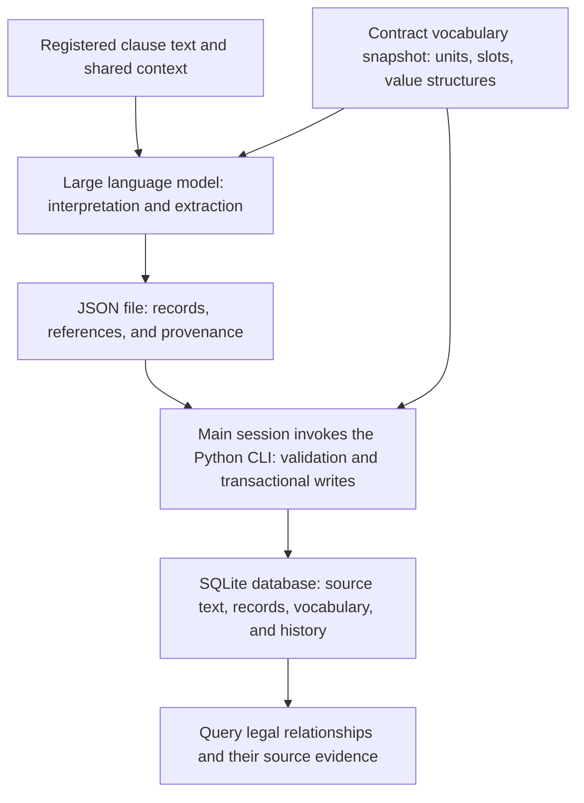

# An Engineering Approach to Representing Legal Relationships

[中文](legal-relations-engineering.md) · [Lawyers' edition](legal-relations-engineering-for-lawyers.en.md)

## 1. From a Single Answer to Sustained Production Use

Giving an agent the full text of a contract and asking it to summarize obligations or answer questions is a direct way to use a language model for contract work. If review confirms that its answer is correct, the model has demonstrated the ability to complete that task. Using this capability in routine operations also requires knowing how it performs on different materials and questions, and what to do when a result fails to meet requirements. **A single execution that produces an answer does not establish readiness for sustained production use.**

Moving from an individual success to sustained use requires addressing uncertainty in generated results. Generation involves randomness, which can affect substantive content: an answer may state a payment amount and deadline while omitting a prerequisite in another clause. An execution can finish normally and produce fluent text while still requiring a check for fidelity to the contract. Correct answers to similar questions in the past provide no guarantee for the current result.

Context engineering can improve reliability by preparing more complete materials, organizing related clauses, and making reading and response requirements explicit. These measures support correct interpretation; the quality of the work must still be assessed from the actual result. Even when the payment prerequisite is included in the context and the instructions expressly require all conditions to be retained, its accurate representation still needs to be checked. Production use requires a way to verify what the model actually accomplished after the context was prepared.

Checking the payment arrangement above means comparing the parties, amount, deadline, and prerequisites in the answer with the source text, then reading the source for omissions. Any problem should be identifiable and correctable at the level of the specific content, so that later users receive the corrected result. When these checks and corrections remain within a single conversation, other tasks have difficulty building on them. Continued use therefore also requires preserving the represented content, its supporting evidence, and subsequent corrections.

cogengine-legal organizes this work around legal relationships. It records the rights, obligations, conditions, limitations, and connections between parties in a shared format with provenance. Records give programmatic checks and semantic review explicit objects to examine, and allow queries and corrections to address specific content. Later tasks can read existing records and build on previous checks and corrections. The model can still misinterpret the text during extraction, and record accuracy remains subject to acceptance review. This organization provides a lasting basis on which verification, correction, and reuse can accumulate.

The approach currently starts with contractual relationships. Contracts bring many arrangements together in written form, providing direct material for testing how legal relationships can be represented. At this stage, the project records what a single contract and its constituent documents stipulate. The people or systems using these records assess actual performance and legal validity using additional evidence and grounds.

To allow the resulting work to be handed over in full, original files, the complete text, relationship records, and provenance are stored together in a SQLite database. The goal is for reading the database to convey the contract: users should be able to retrieve its provisions and trace each record back to the text that supports it. Reaching that goal requires specifying how contractual content should be organized, represented, and verified.

## 2. Organizing Dispersed Provisions into Legal Relationships

Contracts are written in chapters and clauses, but the content of a legal relationship often crosses those boundaries. A payment obligation may appear in a payment clause, its amount may depend on a price schedule, its deadline may depend on acceptance provisions, and a limitation of liability may appear in another chapter. A single clause may also contain several arrangements involving different parties.

Readers establish these connections as they interpret the text. The project aims to preserve those connections so that subsequent work can build on that understanding. Retrieving a party's payment obligations should also retrieve the amounts, deadlines, conditions, and exceptions. Comparing two arrangements should make clear whether the same kinds of content are being compared.

The project therefore organizes records around specific legal relationships. The original clause order is preserved, while the relationship records provide another reading path: from a party to its relationships, from a relationship to its details, and through references to related provisions and supporting evidence.

This data representation can support several uses. Contract review can add checking rules, performance management can incorporate facts about what has happened, and dispute analysis can connect evidence. These applications share the data describing the contract's provisions and remain responsible for their respective judgments.

These uses require the agreed terms to be represented fully. For example, determining whether a payment is overdue requires combining the contractual deadline with facts about actual performance. This project supplies the contractual provisions and their textual basis. Applications built on that data can introduce facts and apply the appropriate analysis and execution rules.

## 3. Representing a Relationship

A relationship between parties must express, at a minimum, which parties are involved, what arrangement exists between them, their respective roles in that arrangement, its specific terms, and the evidence supporting those terms.

The current model organizes this as:

**Two parties and their respective roles + relationship category + details + related references + provenance.**

Consider this short illustrative example:

> The total contract price is 1,000,000 yuan. The buyer shall pay the seller 20% of the total contract price within 30 days after successful acceptance.

These two sentences can produce the following interconnected information:

| Content | Representation |
|---|---|
| Buyer and seller | Create a separate party record for each and refer to it by an identifier. |
| Payment relationship | The buyer is the obligor, the seller is the recipient, and the relationship category is payment. |
| Total contract price | Create a defined value of 1,000,000 yuan that other content can reference. |
| Payment amount | Preserve the formula “total contract price × 20%” and its reference to the price definition. |
| Payment deadline | Preserve the reference to successful acceptance and the requirement to pay within 30 days afterward. |
| Supporting evidence | Link each item above to the text that supports it. |

The amount thus retains its calculation basis, and the deadline retains the event from which it runs. References remain usable even when the price and acceptance provisions appear in other clauses.

Technically, this is a set of identified objects and their connections. Parties, events, and defined values are nodes that can be referenced; relationship records connect parties; detail records belong to relationships; and references connect conditions, calculations, and related provisions. The current implementation stores these in SQLite record and link tables, using identifiers and queries to reconstruct the connections.

An “event” represents an occurrence that the contract actually uses as a condition or a reference point for time. In the example, several provisions may refer to the same successful acceptance, each retaining its own deadline or combination of conditions. Whether that event has occurred requires separate facts about the world. Determining whether two mentions refer to the same event also requires textual evidence; matching names alone do not justify merging records.

Arrangements involving multiple parties are decomposed into relationships between pairs of parties according to the actual provisions, while preserving shared amounts, conditions, and effects on other relationships. Provisions concerning the contract as a whole, such as its constituent documents, conditions for taking effect, and definitions, are represented with the contract itself as their subject. This gives different kinds of content explicit places in the model and allows multiple records to jointly express complex relationships.

Details use basic value forms such as quantities, time, conditions, formulas, text, and references, combined into lists or compound structures where needed. The model retains optional auxiliary classifications such as obligation, power, permission, and immunity. The meaning of a relationship is still expressed collectively by the parties' roles, the action involved, its details, and its references.

## 4. Connecting Domain Knowledge to Program Structure Through a Vocabulary

A record format also needs shared conceptual conventions. If extraction tasks freely invent names for relationship categories and details, the same kind of arrangement will acquire multiple representations that are difficult to identify and aggregate through queries.

The project makes these conventions explicit through a vocabulary with two levels:

- **Transaction units** represent arrangements such as payment, delivery, acceptance, and confidentiality.
- **Provision slots** represent the specific dimensions that can be recorded for a kind of arrangement, such as amount, deadline, prerequisites, and liability limits.

The vocabulary also specifies the value structure and applicability of each slot. The language model uses it to choose how to express the source text; the program uses it to check whether a category exists, whether a slot applies, and whether a value has the required structure. An available slot indicates what can be expressed. Filling it still requires support in the source text.

In the example, “payment” and dimensions such as amount and deadline come from the vocabulary; 1,000,000 yuan, 20%, and 30 days come from the particular contract. This distinction allows domain knowledge and individual records to accumulate separately. New domain concepts can be added through vocabulary extensions when the existing value forms are sufficient. Changes to the underlying value syntax require corresponding program changes.

The vocabulary is developed from a corpus and reviewed by domain professionals. Each contract database starts with a complete snapshot, and subsequent extraction and validation use that same version. When the vocabulary cannot accommodate a provision, the system retains what it can express and records the gap with supporting text. Gaps can inform later governance of the shared vocabulary, while existing databases retain their own vocabulary and basis for interpretation.

The vocabulary therefore captures the project's understanding of the domain: which arrangements deserve separate categories, which differences are details within one category, and how to apply these distinctions consistently to real documents.

## 5. From Contract Text to a Database

Implementing this approach requires two kinds of capability. A large language model interprets natural language, identifies parties and provisions, and determines reference relationships. The program preserves text, validates data structures, resolves references, and performs writes. They exchange information through an explicit JSON data format.

The diagram summarizes the division of work between extraction and writing. The system prepares the material before extraction begins.

An explicitly configured converter turns original files into text. Both the originals and the converted full text are registered in the database. The text is then split according to the contract's own clause structure, preserving headings, paragraphs, list items, and the conditions and exceptions within them. Joining the resulting clauses must reproduce the registered text character for character. Dividing the reading work must also preserve clause membership.

Long contracts are first read in contiguous sections. A single synthesis task then consolidates the overview, parties, and event records. The overview provides shared background; the registered parties and events provide reusable identifiers and provenance. Subsequent extraction tasks therefore receive context spanning multiple clauses.

The system then tags and groups clauses by transaction unit to bring related content together for the language model. Responsibility for complete extraction remains attached to individual clauses: a task responsible for a clause must handle all of its provisions. Grouping labels help organize context. Multiple tasks can process different clauses in parallel, sharing the prepared overview, object records, and vocabulary.

Each extraction task writes its results to a complete JSON file. The main session submits these files through the command-line tool, which checks fields, vocabulary, references, value structures, and provenance. If any record fails write validation, the entire submission is rolled back and specific errors are returned for correction. A submission that passes is written in a single transaction. Resubmitting a previously accepted file without changes returns the original result, avoiding duplicate records.

Workflows are described in skill documents that tell the language model how to read, divide work, and submit results. Python command-line tools perform deterministic operations, with the core runtime using the standard library and SQLite. The database also contains the original materials and vocabulary snapshot, allowing a contract database to be handed over and interpreted independently. The caller configures the document converter's dependencies separately.

## 6. Making Reliability a Property of Records and Checks

Structured representation involves interpretation, so every record needs evidence that supports review. The project connects records to materials through anchors in the source text. An anchor identifies a specific clause in a text version and a quotation from it, distinguishing occurrences when the quotation appears more than once. The program checks whether the quotation can be found verbatim in that clause. The clause in turn links to the converted full text and the original file.

This creates a queryable path: **assertion in a record → source anchor → clause and text version → original file.** Direct statements from the text, mechanical transformations, and explicit inferences each retain the appropriate provenance. Transformations preserve the original form and the rule used; inferences preserve their premises and identify who made the judgment.

What the program can check deterministically becomes an explicit constraint: whether clauses cover the full text, quotations exist, references are valid, numeric transformations follow the agreed rules, and identified designations have been bound to parties. Differences between numbers in the source and extracted values prompt review; a difference alone does not establish an omission.

These checks also have clear limits. The presence of a quotation does not prove that its interpretation is correct. A record for every clause does not prove that every provision within those clauses has been represented. The project therefore also needs acceptance reviews of real contracts in both directions: read the contract clause by clause to check that its content is represented, and read the records item by item to check that the text supports them. The object of evaluation is the full meaning expressed collectively by related records. Reasonable differences in representation must be assessed in that context.

When an error is found, relationships and details are corrected by appending complete new versions. Object identifiers remain stable, and earlier records and their provenance are preserved. Queries return the current version by default and can also retrieve history. Blanks in the source, missing materials, vocabulary limitations, and extraction omissions are distinguished, so that a missing record is not automatically interpreted as the absence of a contractual provision.

The design makes quality requirements concrete at three levels: records carry evidence, the program checks deterministic constraints, and semantic completeness and fidelity are tested against actual documents.

## 7. What the Project Aims to Preserve

The project aims to accumulate three kinds of lasting assets: a structure for representing legal relationships, a governed domain vocabulary, and individual records with provenance and revision history. Model capabilities and extraction workflows can continue to improve, while these assets should remain readable and reusable by later tools.

Contractual relationships currently provide the scope for applying this approach. Real contracts must test whether the structure is sufficient, whether the vocabulary covers the actual arrangements, and whether extraction preserves their full meaning. Cross-references, differences between stages, and arrangements involving multiple parties in long contracts are particularly useful for exposing problems that short examples cannot demonstrate.

Extending the approach to other legal relationships will require examining new information sources, factual grounds, and ways in which relationships change. Work on contracts can contribute methods and experience; the scope of their applicability requires further validation.

Ultimately, an engineering approach to legal relationships aims to turn provisions in legal materials into organized, supported, maintainable information, giving subsequent analysis a foundation that can be inspected and reused.

## 8. Planned Extensions

The current release provides infrastructure: it organizes the legal relationships stipulated in a contract into structured information that can be queried, maintained, and traced to the original text. Different tasks can share this information, making it a starting point for further applications. The near-term plans are contract review, followed by contract revision and clause drafting. A longer-term direction is contract management based on structured contracts.

### Contract Review

Contract review is the most natural application of this foundation. Assessing whether an arrangement is appropriate first requires establishing what the contract stipulates, including the parties' rights and obligations, applicable conditions, limitations and exceptions, and the effect of other clauses. The project's structured representation is intended to preserve these details and their connections.

On this basis, contractual arrangements can be evaluated from a specified review perspective and against applicable review criteria. For example, recording a payment obligation's amount, deadline, and prerequisites together gives the reviewer a more complete account of the arrangement to assess. Review comments can also be linked to the particular arrangements being evaluated and their supporting text, allowing users to understand, verify, and act on them.

### Contract Revision and Clause Drafting

Review often leads to a further question: how should the existing arrangements change, and how should those changes be expressed in the contract? Contract revision and clause drafting therefore form the next application direction.

Contract clauses express the legal relationships the parties wish to establish. Changing payment conditions, adjusting the scope of liability, or adding an obligation each involves determining the specific content of those relationships. Structured representation can therefore help both with understanding an existing contract and with clarifying what proposed clauses need to express. The understanding developed around a contract can carry through from review to revision and drafting, and provide a basis for checking whether the revised terms reflect the intended arrangements.

### Contract Management Based on Structured Contracts

The longer-term prospect is to keep this information useful after the contract is signed, forming the basis of a management system built on structured contracts.

The specific arrangements stipulated in a contract are valuable to its ongoing management. Beyond basic information such as price, subject matter, and signing date, the parties' obligations, conditions for performance, deadlines, ways of exercising rights, and the effects of one arrangement on another may all matter to subsequent business activity. When these details remain available for querying and use, contract management can be organized around specific rights and obligations and incorporate facts about actual performance to support work throughout the life of the contract.

This direction extends the project's central idea: an accurate understanding of a contract should yield work that remains usable over time. Review uses that work to evaluate existing arrangements; revision and drafting use it to express intended arrangements; and contract management keeps it useful in subsequent business activity. The infrastructure being developed provides a shared information foundation for these applications.
