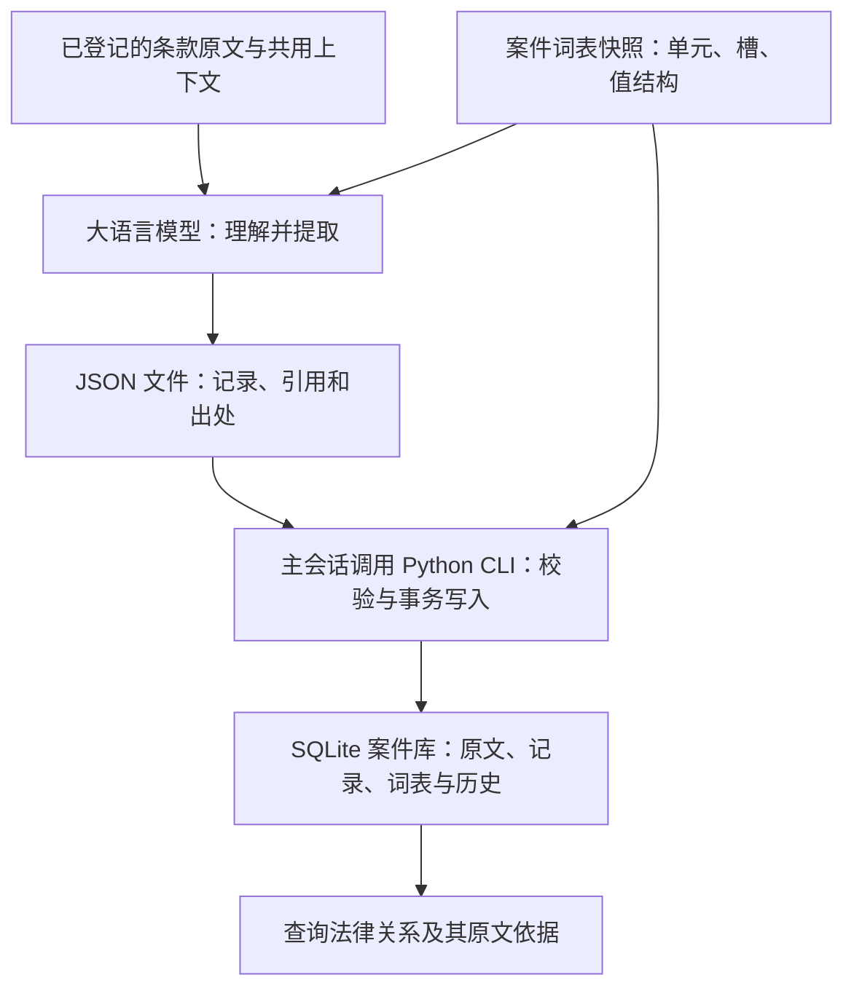

# 法律关系的工程化表达

[English](legal-relations-engineering.en.md) · [律师版](legal-relations-engineering-for-lawyers.md)

## 一、从一次回答到持续交付

把合同全文交给 agent，让它归纳义务、回答问题，是使用语言模型处理合同的一种直接方式。如果答案经过核对确实正确，就说明模型具备完成这项任务的能力。将这种能力投入日常业务以后，还需要知道它在不同材料、不同问题上的表现，以及交付结果不符合要求时应当怎样处理。**一次能够给出答案的执行，并不能证明已经具备持续交付的条件。**

从单次成功走向持续交付，首先要面对生成结果的不确定性。agent 的生成存在随机性，这种不确定性可能影响业务内容：例如，回答写出了付款金额和期限，却漏掉了另一条款中的付款前提。执行可以正常结束，表述也可以十分流畅，使用者仍须核对它是否忠实于合同。此前答对过同类问题，无法为这一次的结果提供保证。

为了提高处理的可靠性，可以通过 context engineering 准备更充分的材料、组织相关条款、明确阅读和回答要求。这些措施为正确理解创造了条件，交付质量仍需从实际结果中检验。即使付款前提已经放进上下文，指令也明确要求保留全部条件，仍须确认它最终是否得到准确表达。对生产使用而言，上下文准备之后，还需要有办法检验模型实际完成了什么。

检验上述付款安排，就需要把答案中的当事人、金额、期限和前提逐项与原文核对，再沿着原文检查是否存在遗漏。发现问题后，还应能够定位和更正具体内容，使后续使用者取得修正后的结果。这样的核对和修正如果只留在某次对话里，其成果就难以被其他任务沿用。因此，持续使用还需要把已经表达的内容、支持它的依据以及后来的修正保存下来。

cogengine-legal 选择以法律关系组织这份成果：将主体之间的权利义务、条件、限制及相互联系，按共同的格式形成带出处的记录。记录为程序检查和语义复核提供了明确对象，也让查询和修正能够针对具体内容进行。后续任务可以读取已有记录，继续使用此前核对和修正的成果。模型在提取时仍可能理解错误，记录的正确性仍须接受验收；这种组织方式使检查、纠错和复用有了可以持续积累的基础。

这套方法当前从合同关系入手。合同将大量安排集中表达在文本中，为检验法律关系的表达方式提供了直接的材料。现阶段，项目针对一份合同及其组成文件，记录文本规定的内容；实际履行情况与法律效力判断，由使用这些记录的人或系统结合其他依据处理。

为了让这份成果能够完整移交，原件、全文、关系记录及其出处共同保存在一个 SQLite 数据库中。项目以“读库即读合同”为目标：使用者能够从库中取得合同规定的内容，并从每项记录回到支持它的原文。实现这一目标，需要进一步明确合同内容应当怎样组织、怎样表达，以及怎样检验。

## 二、把分散的规定组织为法律关系

合同按章节和条款书写，法律关系的内容却经常跨越这些边界。付款义务可能写在付款条款里，金额依赖价格表，起算时间依赖验收规定，责任限制又在另一章。同一条款也可能同时包含几个主体的不同安排。

阅读者会在理解中建立这些联系。项目希望把这些联系保存下来，让后续工作能够继续使用这份理解。检索某个主体的付款义务时，应当一并取得金额、期限、条件和例外；比较两项安排时，也应当能够知道比较的是同一类内容。

因此，项目选择以具体法律关系组织记录。原文的条款顺序继续保留，关系记录则提供另一条阅读路径：从主体找到关系，从关系取得细节，再沿引用找到相关规定和依据。

建立这种数据表达，本身就能支持多种用途。合同审核可以在其上叠加检查规则，履约管理可以加入实际发生的事实，争议分析可以连接证据。各项应用共同使用合同规定的数据，并分别承担自己的判断。

这些用途要求先把约定内容表达完整。例如，判断付款是否逾期，需要将合同期限与现实履行事实结合。本项目提供合同规定及其原文依据，上层应用可以在同一数据基础上引入事实，采用相应的分析和执行规则。

## 三、一项关系怎样表示

一条当事人关系至少需要表达：谁与谁之间存在什么安排，各自在其中处于什么地位，安排有哪些具体内容，以及这些内容的依据是什么。

当前模型把它组织为：

**两个主体及各自性质＋关系所属类别＋具体细节＋相关引用＋出处。**

用一个自拟的短例子说明：

> 合同总价为 100 万元。买方应在验收合格后 30 日内，向卖方支付合同总价的 20%。

这两句话可以形成以下相互关联的信息：

| 内容 | 表达方式 |
|---|---|
| 买方、卖方 | 分别建立主体记录，以标识引用 |
| 付款关系 | 买方是义务人，卖方是受领人，关系类别为付款 |
| 合同总价 | 建立值为 100 万元的定义值，供其他内容引用 |
| 付款金额 | 保存“合同总价×20%”的计算结构，并引用总价定义 |
| 付款期限 | 保存验收合格事项的引用，以及其后 30 日内的时间要求 |
| 依据 | 将上述信息分别连接到支持它们的原文 |

这样，金额保留了计算依据，期限保留了起算依据。即使总价和验收规定出现在其他条款中，仍能通过引用取得。

在技术上，这是一组带标识的对象及其联系。主体、事件、定义值等作为可引用的节点；关系记录连接主体；细节记录依附于关系；引用连接条件、计算和相关规定。当前实现把它们存放在 SQLite 的记录与关联表中，通过标识和查询重建这些联系。

其中，“事件”表示合同实际用作条件或时间基准的一项发生事项。例子中的“验收合格”可以被多条规定共同引用，每条规定分别保存自己的期限或条件组合。事件是否已经发生，需要另外取得现实事实。同一事件的判断也要依据原文，名称相同本身不足以合并记录。

多方安排按原文实际规定拆成两两之间的关系，同时保留共同金额、条件和相互影响。合同的文件构成、生效条件、定义等整体规定，则以合同本身为主语表达。这样的安排让不同内容有明确位置，也使复杂关系能够通过多条记录共同表达。

具体细节使用量、时间、条件、算式、文本和引用等基本值形态，必要时组合成列表或复合结构。模型保留“义务、权力、许可、豁免”等可选辅助分类；关系的含义仍由当事人性质、行为内容、细节和引用共同承担。

## 四、用词表连接专业知识与程序结构

仅有记录格式，还需要共同的概念约定。不同提取任务如果随意命名关系类别和细节，同一种安排就会出现多套表达，查询时难以识别和汇总。

项目用两层词表明确这种约定：

- **交易单元**：表示付款、交付、验收、保密等安排。
- **规定槽**：表示一类安排可以记载的具体维度，例如金额、期限、前置条件和责任上限。

词表还规定槽的值结构及适用范围。模型据此选择如何表达原文，程序据此检查类别是否存在、某个槽是否适用、取值是否符合结构。可用的槽只说明表达能力，填写仍以原文依据为前提。

在前面的例子里，“付款”及其金额、期限等维度来自词表；100 万元、20% 和 30 日来自具体合同。这个区分使专业知识与具体记录能够分别积累。新增领域概念时，只要现有值形态足以表达，就可以通过词表扩展；改变基本值语法，则需要同步调整程序。

词表通过语料归纳和专业人员审定形成。每份案件在开始时保存完整快照，此后的提取和校验使用同一版本。遇到词表无法容纳的规定，保留可表达的内容，并记录带原文依据的缺口。缺口可供后续全局治理参考，旧案件继续保留自己的词表和解释基础。

因此，词表承载着项目对领域的认识：哪些安排值得单独分类，哪些差异属于同类安排的细节，以及怎样让这些区分在实际材料中保持一致。

## 五、从合同文本到数据库

实现这套方法需要两种能力。大语言模型负责理解自然语言、识别主体和规定、判断引用关系；程序负责保存文本、验证数据结构、解析引用和执行写入。两者通过明确的 JSON 数据格式交接。

这张图概括的是提取与写入的分工。进入提取之前，系统先完成材料准备。

原始文件由显式配置的转换程序转为文本，原件和转换全文一起登记入库。随后按合同本身的条款结构切分，保留标题、段落、列项及其内部的条件和例外。切分结果必须能逐字拼回登记全文，阅读分段也不能改变条款的归属。

长合同先按连续范围分段阅读，再由一个归纳任务统一形成案件概要、主体和事件记录。概要提供共同背景，已入库的主体和事件提供可复用的标识及出处。后续提取任务由此获得跨条款上下文。

系统再按交易单元打标、分组，组织相关内容供模型阅读。完整提取责任始终落在具体条款上：一个任务负责一条款，就需要处理其中的全部规定；分组标签只帮助组织上下文。多个任务可以并行处理不同条款，共用已准备好的概要、对象记录和词表。

每个提取任务将结果写为完整 JSON 文件。主会话统一调用命令行工具提交，程序检查字段、词表、引用、值结构和出处。任一记录未通过写入校验，整份提交回退，返回具体错误供修正；通过后，以一次事务写入。成功文件原样重提返回原有结果，避免产生重复记录。

工作流以 skill 文档承载，说明模型怎样阅读、分工和提交；Python 命令行工具执行确定性操作，核心运行代码使用标准库和 SQLite。数据库随同保存原始材料和词表快照，使一份案件能够独立移交和解释。材料转换程序的依赖由调用方另外配置。

## 六、把可信要求落实到记录和检查中

结构化表达包含解释，因此每项记录需要保留足以复核的依据。项目采用“原文锚”连接记录与材料：锚指定文本版本中的具体条款及原文引句，引句重复时再区分出现位置。程序检查引句能否在指定条款中逐字找到；条款继续关联转换全文和原件。

由此形成一条可查询的路径：**记录中的主张 → 原文锚 → 条款与文本版本 → 原始文件。** 原文直接记载、机械转换和显式推断分别保存相应的来源说明。转换保留原始写法及规则，推断保留前提及责任主体。

程序能确定检查的内容，被落实为具体约束：条款是否覆盖全文，引文是否存在，引用是否有效，数值转换是否符合约定，已识别称谓是否完成主体绑定。原文数字与提取值之间的差异用于提示复核，差异本身不直接证明遗漏。

这些检查也有明确边界。引文存在，并不能证明对它的解释正确；每条款有记录，也不能证明条款中的所有规定均已表达。项目还需要用真实合同进行双向验收：逐条读合同，检查内容是否进入模型；逐项读记录，检查它是否得到原文支持。评价对象是相关记录共同表达的完整含义，合理的表达差异需要结合整体判断。

错误被发现后，关系和细节通过追加完整版本修正，对象标识保持稳定，旧记录及其出处继续保留。查询默认取得当前版本，也能够回看历史。原文留空、材料未提供、词表不足和提取遗漏分别说明，避免把记录缺失直接解释为合同未约定。

这套设计把质量要求落在三个可操作的层面：记录有依据，程序检查确定性约束，语义完整性和忠实性接受实际材料的检验。

## 七、项目希望留下的东西

项目希望积累三类可以长期使用的成果：法律关系的表达结构、经过治理的专业词表，以及带出处和修订历史的具体记录。模型能力和提取流程可以继续改进，这些成果仍应能够被后续工具读取和复用。

目前，合同关系为这套方法提供实践范围。表达结构是否充分，词表是否覆盖实际安排，提取是否保留完整含义，都需要由真实合同检验。长篇合同中的交叉引用、阶段差异和多方安排，尤其能够暴露短例子难以展示的问题。

向其他法律关系扩展时，还需要考察新的信息来源、事实依据和关系变化方式。合同实践可以贡献方法与经验，具体适用范围则需要继续验证。

法律关系的工程化，最终要使法律材料中的规定成为有组织、有依据、可以持续维护的信息，让后续分析建立在能够检查和复用的基础上。
